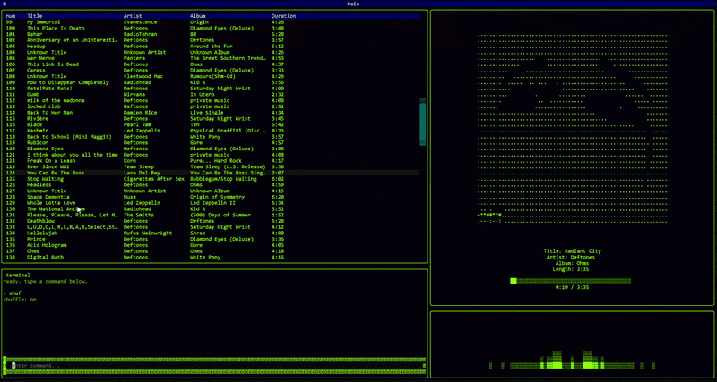

# 🎵 CLPYmusic

A modern terminal music player built with Python.

CLPYmusic brings a full music-player experience directly into your terminal with a clean Textual-based interface, real-time audio visualization, album artwork support, queue management, and keyboard-driven controls.
(its 4:30 in the morning)
No bloated GUI. No browser tabs. Just music and your terminal.

---

## Preview

<p align="center">
  
</p>

---

## Features

* Real-time audio visualizer
* Local music library browsing
* Queue and playlist management
* Album artwork display
* Keyboard shortcuts
* Song progress tracking
* Clipboard integration
* Lightweight and fast
* Cross-platform Python package

---

## Installation

```bash
pip install CLPYmusic
```

---

## Launch

```bash
climusic
```

---

## Why CLPYmusic?

Most terminal music players feel like they were designed during the Stone Age and never updated.(I actually never seen one)

CLPYmusic was built to provide a modern terminal experience while keeping the speed and simplicity that makes terminal applications enjoyable.(I just like these things)

Whether you're coding, studying, or simply prefer living inside your terminal, CLPYmusic keeps your music one command away.(I'm tired)

---

## Built With

* Python
* Textual
* VLC
* Librosa
* Mutagen
* Miniaudio
* NumPy
* Pillow
* And whatever joy was left in me

---

## Keyboard Driven

Designed around fast navigation and minimal mouse usage.

Control playback, browse your library, manage queues, and navigate your music collection without leaving the keyboard.

---

## Installation Requirements

CLPYmusic relies on VLC for audio playback.

Make sure VLC is installed on your system:

* Windows: Install VLC Media Player
* macOS: Install VLC Media Player
* Linux: Install VLC through your distribution's package manager

---

## Development

Clone the repository:

```bash
git clone https://github.com/HnarimanH/CLI-music-player.git
cd CLI-music-player
```

Create a virtual environment:

```bash
python -m venv venv
```

Activate it:

### Windows

```bash
venv\Scripts\activate
```

### Linux / macOS

```bash
source venv/bin/activate
```

Install dependencies:

```bash
pip install -r requirements.txt
```

Run locally:

```bash
python -m climusic
```

---

## Contributing

Pull requests, bug reports, feature suggestions, and feedback are welcome.

If you discover a bug, open an issue and include as much detail as possible.

---

## License

MIT License

---

<p align="center">
Built because WHY NOT!?
</p>
