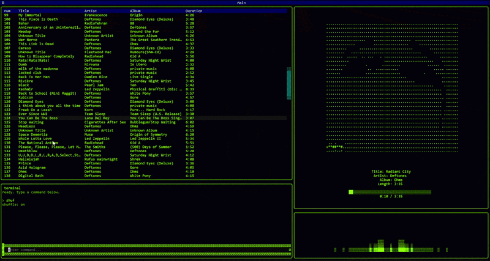

# 🎵 CLPYmusic

A terminal music player built in Python, running somewhere between “late-night cyberpunk alley” and “why am I still awake at 4:30AM”.

CLPYmusic turns your terminal into a living audio space:
- Textual UI that feels like a neon dashboard
- Real-time visualizer that reacts like it has emotions
- Queue control like you’re hacking your own soundtrack
- No browser tabs. No bloated GUI. Just you and the noise.

It’s basically: *“what if your music player lived inside a glowing terminal in a dystopian future, but it’s also kinda tired like Jake from Adventure Time after solving emotional problems all day.”*

---

## 🌌 Preview

<p align="center">
  
</p>

---

## ⚡ Features

* Real-time audio visualizer that feels slightly alive
* Synchronized karaoke lyrics with real-time neon highlighting and auto-scrolling
* Online lyrics auto-fetch (LRCLIB) and offline caching (`.lrc` files & embedded tags)
* Live lyrics subtitle on Now Playing dashboard
* Local music library browsing (your chaos, organized… kinda)
* Queue system for emotional damage playlists
* Album art support because we’re not animals
* Keyboard-driven control (no mouse, we suffer with style)
* Progress tracking for songs you swear you’ll finish this time
* Clipboard integration for reasons you’ll forget at 3AM
* Lightweight enough to pretend it’s efficient

---

## 📦 Installation

```bash
pip install CLPYmusic
```

---

## Launch

```bash
climusic
```

---

## Why CLPYmusic?

Most terminal music players feel like they were designed during the Stone Age and never updated.(I actually never seen one)

CLPYmusic was built to provide a modern terminal experience while keeping the speed and simplicity that makes terminal applications enjoyable.(I just like these things)

Whether you're coding, studying, or simply prefer living inside your terminal, CLPYmusic keeps your music one command away.(I'm tired)

---

## Built With

* Python
* Textual
* VLC
* Librosa
* Mutagen
* Miniaudio
* NumPy
* Pillow
* And whatever joy was left in me

---

## Keyboard Driven & Controls
 
Designed around fast navigation and minimal mouse usage.
 
### Hotkeys
* `space` - Pause / Resume playback
* `d` / `a` - Next / Previous song
* `w` / `s` - Volume up / down
* `q` / `e` - Skip back / forward 5s
* `l` - Toggle synchronized lyrics view
* `+` / `-` - Increase / decrease lyrics text size (normal / large / huge)
* `up` / `down` / `j` / `k` - Scroll lyrics manually
* `esc` - Close lyrics / search and return to library
 
### Search & Download Commands
* `search <query>` (or `s <query>`) - Search Spotify for tracks with album name & cover art
* `dl <1-5>` - Download song with embedded album name and high-res cover art
* `spotify token <access_token>` - Save Spotify Web API bearer token
* `spotify config <client_id> <client_secret>` - Save Spotify client credentials
* `spotify status` - Check current Spotify integration status

### Lyrics & Cover Commands (Mini-Terminal)
* `lyrics`, `lyr`, `l` - Toggle lyrics view
* `lyrics size <normal|large|huge>` - Adjust lyrics text size
* `lyrics on` / `lyrics off` - Explicitly show or hide lyrics
* `lyrics fetch` - Re-fetch online lyrics for current track
* `lyrics search <query>` - Search LRCLIB for lyrics
* `lyrics select <1-5>` - Apply and cache chosen lyric result
* `lyrics offset <+ms/-ms>` - Adjust synchronization timing (e.g. `lyrics offset +500`)
* `lyrics copy` - Copy complete lyrics to clipboard
* `lyrics reload` - Reload lyrics from disk/cache
* `cover <width>` - Set album cover size (e.g. `cover 72`, `cover 80`, `cover 100`, `cover auto`)
* `cover +/-` - Increase or decrease cover size by 4 pixels on the fly
* `cover <preset>` - Quick presets: `cover small` (40), `medium` (56), `big` (72), `huge` (88), `max` (104)
* `cover <style>` - Switch rendering style: `pixel` (2x true-color half-blocks), `ascii` (keyboard symbols), `braille` (8x dot matrix), `quadrant` (4x sub-pixels), `blocks` (shaded Unicode blocks)
* `cover contrast <0.5-3.0>` - Fine-tune image contrast boost
* `cover` (or `cover status`) - Display active cover resolution, style, and pixel statistics
---

## Installation Requirements

CLPYmusic relies on VLC for audio playback.

Make sure VLC is installed on your system:

* Windows: Install VLC Media Player
* macOS: Install VLC Media Player
* Linux: Install VLC through your distribution's package manager

---

## Development

Clone the repository:

```bash
git clone https://github.com/HnarimanH/CLI-music-player.git
cd CLI-music-player
```

Create a virtual environment:

```bash
python -m venv venv
```

Activate it:

### Windows

```bash
venv\Scripts\activate
```

### Linux / macOS

```bash
source venv/bin/activate
```

Install dependencies:

```bash
pip install -r requirements.txt
```

Run locally:

```bash
python -m climusic
```

---

## Contributing

Pull requests, bug reports, feature suggestions, and feedback are welcome.

If you discover a bug, open an issue and include as much detail as possible.

---

## License

MIT License

---

<p align="center">
Built because WHY NOT!?
</p>
